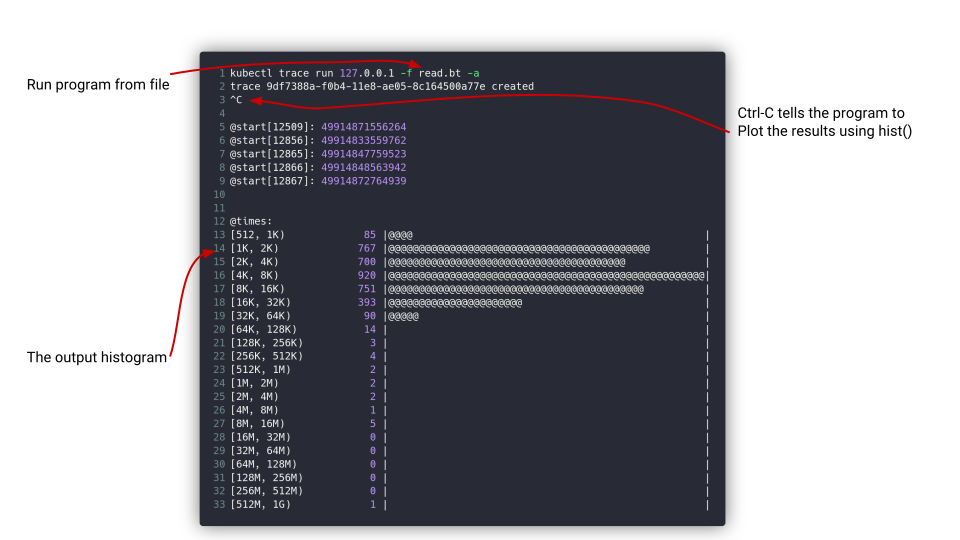
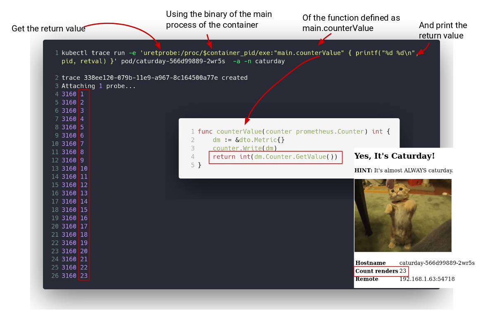

`kubectl trace` is a kubectl plugin that allows you to schedule the execution
of [bpftrace](https://github.com/iovisor/bpftrace) programs in your Kubernetes cluster.



<!-- toc -->

- [Installing](#installing)
  - [Pre-built binaries](#pre-built-binaries)
  - [Source](#source)
  - [Packages](#packages)
    - [Arch - AUR](#arch---aur)
- [Architecture](#architecture)
- [Usage](#usage)
  - [Run a program from string literal](#run-a-program-from-string-literal)
  - [Run a program from file](#run-a-program-from-file)
  - [Run a program against a Pod](#run-a-program-against-a-pod)
  - [Running against a Pod vs against a Node](#running-against-a-pod-vs-against-a-node)
  - [Using a custom service account](#using-a-custom-service-account)
  - [Executing in a cluster using Pod Security Policies](#executing-in-a-cluster-using-pod-security-policies)
  - [More bpftrace programs](#more-bpftrace-programs)
- [Status of the project](#status-of-the-project)
- [Contributing](#contributing)

<!-- tocstop -->

## Installing

### Pre-built binaries

See the [release](https://github.com/iovisor/kubectl-trace/releases) page for the full list of pre-built assets.

The commands here show `amd64` versions, `386` versions are available in the releases page.

**Linux**

```bash
curl -Lo https://github.com/iovisor/kubectl-trace/releases/download/v0.1.0-rc.0/kubectl-trace_0.1.0-rc.0_linux_amd64.tar.gz
tar -xvf kubectl-trace.tar.gz
mv kubectl-trace /usr/local/bin/kubectl-trace
```

**OSX**

```bash
curl -Lo https://github.com/iovisor/kubectl-trace/releases/download/v0.1.0-rc.0/kubectl-trace_0.1.0-rc.0_linux_amd64.tar.gz
tar -xvf kubectl-trace.tar.gz
mv kubectl-trace /usr/local/bin/kubectl-trace
```


**Windows**

In PowerShell v5+
```powershell
$url = "https://github.com/iovisor/kubectl-trace/releases/download/v0.1.0-rc.0/kubectl-trace_0.1.0-rc.0_windows_amd64.zip"
$output = "$PSScriptRoot\kubectl-trace.zip"

Invoke-WebRequest -Uri $url -OutFile $output
Expand-Archive "$PSScriptRoot\kubectl-trace.zip" -DestinationPath "$PSScriptRoot\kubectl-trace"
```

### Source

```
go get -u github.com/iovisor/kubectl-trace/cmd/kubectl-trace
```

This will download and compile `kubectl-trace` so that you can use it as a kubectl plugin with `kubectl trace`

### Packages

You can't find the package for your distro of choice?
You are very welcome and encouraged to create it and then [open an issue](https://github.com/iovisor/kubectl-trace/issues/new) to inform us for review.

#### Arch - AUR

The official [PKGBUILD](https://aur.archlinux.org/cgit/aur.git/tree/PKGBUILD?h=kubectl-trace-git) is on AUR.

If you use `yay` to manage AUR packages you can do:

```
yay -S kubectl-trace-git
```

## Architecture

See [architecture.md](/docs/architecture.md)

## Usage

You don't need to setup anything on your cluster before using it, please don't use it already
on a production system, just because this isn't yet 100% ready.

### Run a program from string literal

In this  case we are running a program that probes a tracepoint
on the node `ip-180-12-0-152.ec2.internal`.

```
kubectl trace run ip-180-12-0-152.ec2.internal -e "tracepoint:syscalls:sys_enter_* { @[probe] = count(); }"
```

### Run a program from file

Here we run a program named `read.bt` against the node `ip-180-12-0-152.ec2.internal`

```
kubectl trace run ip-180-12-0-152.ec2.internal -f read.bt
```

### Run a program against a Pod



That pod has a Go program in it that is at `/caturday`, that program has a function called `main.counterValue` in it that returns an integer
every time it is called.

The purpose of this program is to load an `uretprobe` on the `/caturday` binary so that every time the `main.counterValue` function is called
we get the return value out.

Since `kubectl trace` for pods is just an helper to resolve the context of a container's Pod, you will always be in the root namespaces
but in this case you will have a variable `$container_pid` containing the pid of the root process in that container on the root pid namespace.

What you do then is that you get the `/caturday` binary via `/proc/$container_pid/exe`, like this:

```
kubectl trace run -e 'uretprobe:/proc/$container_pid/exe:"main.counterValue" { printf("%d\n", retval) }' pod/caturday-566d99889-8glv9 -a -n caturday
```

### Running against a Pod vs against a Node

In general, you run kprobes/kretprobes, tracepoints, software, hardware and profile events against nodes using the `node/node-name` syntax or just use the
node name, node is the default.

When you want to actually probe an userspace program with an uprobe/uretprobe or use an user-level static tracepoint (usdt) your best
bet is to run it against a pod using the `pod/pod-name` syntax.

It's always important to remember that running a program against a pod, as of now, is just a facilitator to find the process id for the binary you want to probe
on the root process namespace.

You could do the same thing when running in a Node by knowing the pid of your process yourself after entering in the node via another medium, e.g: ssh.

So, running against a pod **doesn't mean** that your bpftrace program will be contained in that pod but just that it will pass to your program some
knowledge of the context of a container, in this case only the root process id is supported via the `$container_pid` variable.


### Using a custom service account

By default `kubectl trace` will use the `default` service account in the target namespace (that is also `default`), to schedule the pods needed for your bpftrace program.

If you need to pass a service account you can use the `--serviceaccount` flag.

```bash
kubectl trace run --serviceaccount=kubectltrace ip-180-12-0-152.ec2.internal -f read.bt
```

### Executing in a cluster using Pod Security Policies

If your cluster has pod security policies you will need to make so that `kubectl trace` can
use a service account that can run privileged containers.

That service account, then will need to be in a group that uses the proper privileged `PodSecurityPolicy`.

First, create the service account that you will use with `kubectl trace`,
you can use a different namespace other than `default`, just remember to pass that namespace to the `run` command when you will use `kubectl trace`:

```yaml
apiVersion: v1
kind: ServiceAccount
metadata:
  name: kubectltrace
  namespace: default
```

Now that we have a `kubectltrace` service account let's create a Pod Security Policy:

```yaml
apiVersion: policy/v1beta1
kind: PodSecurityPolicy
metadata:
  name: kubectltrace
spec:
  fsGroup:
    rule: RunAsAny
  privileged: true
  runAsUser:
    rule: RunAsAny
  seLinux:
    rule: RunAsAny
  supplementalGroups:
    rule: RunAsAny
  volumes:
  - '*'
  allowedCapabilities:
  - '*'
  hostPID: true
  hostIPC: true
  hostNetwork: true
  hostPorts:
  - min: 1
    max: 65536
```

Ok, this `PodSecurityPolicy` will allow users assigned to it to run privileged containers,
`kubectl trace` needs that because of the extended privileges eBPF programs need to run with
to trace your kernel and programs running in it.

Now with a `ClusterRoleBinding` you bind the `ClusterRole` with the `ServiceAccount`, so that
they can work together with the `PodSecurityPolicy` we just created.

You can change the `namespace: default` here if you created the service account in a namespace other than `default`.

```yaml
apiVersion: rbac.authorization.k8s.io/v1
kind: ClusterRole
metadata:
  name: kubectltrace-psp
rules:
- apiGroups:
  - policy
  resources:
  - podsecuritypolicies
  resourceNames:
  - kubectltrace
  verbs:
  - use
---
apiVersion: rbac.authorization.k8s.io/v1
kind: ClusterRoleBinding
metadata:
    name: kubectltrace-psp
subjects:
- kind: ServiceAccount
  name: kubectltrace
  namespace: default
roleRef:
   apiGroup: rbac.authorization.k8s.io
   kind: ClusterRole
   name: kubectltrace-psp
```

OK! Now that we are all set we can just run the program by specifying the service account
we just created and it will use our pod security policy!

```bash
kubectl trace run --serviceaccount=kubectltrace ip-180-12-0-152.ec2.internal -f read.bt
```

If you used a different namespace other than default for your service account, you will want to specify the namespace too, like this:

```bash
kubectl trace run --namespace=mynamespace --serviceaccount=kubectltrace ip-180-12-0-152.ec2.internal -f read.bt
```

### More bpftrace programs

Need more programs? Look [here](https://github.com/iovisor/bpftrace/tree/master/tools).

## Status of the project

:trophy: All the MVP goals are done!

To consider this project (ready) the goals are:

- [x] basic program run and attach
- [x] list command to list running traces - command: `kubectl trace get`
- [x] delete running traces
- [x] run without attach
- [x] attach command to attach only - command: `kubectl trace attach <program>`
- [x] allow sending signals (probably requires a TTY), so that bpftrace commands can be notified to stop by the user before deletion and give back results


**More things after the MVP:**

<i>The stuff here had been implemented - YaY</i>

<strike>The program is now limited to run programs only on your nodes but the idea is to have the ability to attach only to the user namespace of a pod, like:

```
kubectl trace run pod/<pod-name> -f read.bt
```

And even on a specific container

```
kubectl trace run pod/<pod-name> -c <container> f read.bt
```

So I would say, the next thing is to run bpftrace programs at a pod scope other than at node scope.</strike>


## Contributing

Already pumped up to commit some code? Here are some resources to join the
discussions in the [IOVisor](https://www.iovisor.org/) community and see
what you want to work on.

* _Mailing List:_ http://lists.iovisor.org/mailman/listinfo/iovisor-dev
* _IRC:_ #iovisor at irc.oftc.net
* _Slack_ #kubectl-trace in the [Kubernetes Slack](http://kubernetes.slack.com/)
* _Kubectl Trace Issue Tracker:_ [Github Issues](https://github.com/iovisor/kubectl-trace/issues)

Special thanks to [Ramon Gilabert](https://github.com/RamonGilabert) for the logo.
